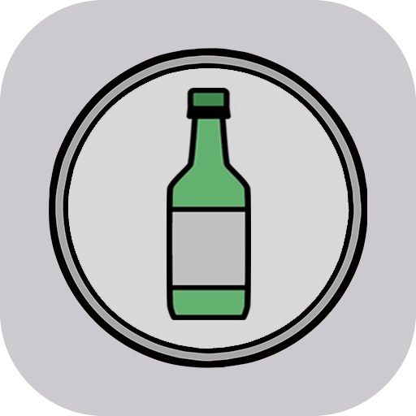

_Read this in other languages: [English](README.eng.md)_

<h1> 이순신 술 게임 </h1>
술 게임 중 하나인 <b>이순신 게임</b> 을 보조하기 위해 만들어진 앱입니다.
  
동전을 잘 소지하지 않는 사람들을 위해 단순한 UI의  <b>동전 던지기 기능과 당첨 애니메이션</b>을 제공합니다.
  
+ 확률을 임의로 조정할 수 있는 기능이 추가되었습니다.

<h3> Screenshots </h3>

 

### 이순신 술 게임 규칙 (참고)

동전 2개를 사용하는 게임의 룰을 따른다.

> 동전 1개 버전도 추가할 예정이었으나,  
> 확률 조정 기능을 넣으면서 의미가 없다고 판단해 추가하지 않았다.

1. 대형 컵 하나를 두고 각자의 턴에서 잔에 (원하는 만큼, 또는 1잔) 술을 따른다.

2. 동전 두개를 던져 결과에 따라 **다음 행동**을 취한다.

   | 100(숫자) | 이순신(그림) | 행동                                  |
   | :-------: | :----------: | :------------------------------------ |
   |     0     |      2       | **잔에 있는 모든 술을 맛있게 먹는다** |
   |     1     |      1       | 잔을 왼쪽(정방향) 사람에게 전달       |
   |     2     |      0       | 잔을 오른쪽(역방향) 사람에게 전달     |

> 참고 : [나무위키-술 게임/운 게임/이순신 게임](https://namu.wiki/w/술%20게임/운%20게임#이순신%20게임)

## 구현 및 개발 관련

아이디어는 [Image-showcase in flutter](https://proandroiddev.com/360-degree-image-showcase-in-flutter-ee53a49e8975)에서 비롯되었고 이를 바탕으로 시퀀스 위젯을 직접 구현하려 했지만 이미 좋은 [패키지](https://pub.dev/packages/image_sequence_animator)가 있어 이 패키지를 사용해 진행하게 되었다.

gif나 영상이 아닌 이미지 시퀀스를 사용한 이유는 다양한 종류의 애니메이션을 효과적으로 구현할 수 있다고 생각했기 때문이다.

하루 만에 asset 제작, 핵심 기능 구현이 완성될 정도로 간단한 프로젝트이다.

## Version

| VERSION   | NOTE                                             |
| --------- | ------------------------------------------------ |
| `0.9.0+2` | 기본 기능 구현(확률 기능 포함)                   |
| `0.9.1+3` | 특정 기기에서 정보 화면, 환경설정 화면 잘림 방지 |

### MileStones

- [x] 핵심 기능 구현
- [x] 확률 수정 기능 추가
- [ ] 이미지 시퀀스를 활용한 애니메이션 종류 늘리기
- [ ] 배경 색 설정 기능 추가
- [ ] 배경 및 확률 정보 DB 저장 기능 구현
- [ ] 당첨 애니메이션 추가

### 저작권 및 License

#### Icons

- [Coin icons created by Freepik - Flaticon](https://www.flaticon.com/free-icons/coin)
- [Settings icons created by Freepik - Flaticon](https://www.flaticon.com/free-icons/settings)
- [Information icons created by Freepik - Flaticon](https://www.flaticon.com/free-icons/information)
- <a href="https://www.flaticon.com/free-icons/soju" title="soju icons">Soju icons created by Freepik - Flaticon</a>

#### Fonts

- [강원교육모두체](https://www.gwe.go.kr/mbshome/mbs/kr/subview.do?id=kr_070902000000)
- [LINE Seed](https://seed.line.me/index_kr.html)

#### Image (purchased)

- [iStock - Korea 100 Won Coin](https://www.istockphoto.com/kr/벡터/korean-100-won-coin-한국-동전-100원-백원-일러스트-gm1254742860-366840028)

#### Core Flutter Package

> Details are included in the app

| PACKAGE                                                                         |   VER   | LICENSE                                                          |
| :------------------------------------------------------------------------------ | :-----: | :--------------------------------------------------------------- |
| [**provider**](https://pub.dev/packages/provider)                               | `6.0.5` | [MIT](https://pub.dev/packages/provider/license)                 |
| [**image_sequence_animator**](https://pub.dev/packages/image_sequence_animator) | `2.0.0` | [MIT](https://pub.dev/packages/image_sequence_animator/license)  |
| [**page_transition**](https://pub.dev/packages/page_transition)                 | `2.0.9` | [BSD 2-Clause](https://pub.dev/packages/page_transition/license) |

#### Description of gitignored assets

- **Coin PNG sequence**

  - `assets/coin/**/` : PNG 시퀀스 폴더, 각각 169프레임(사진), 4종류
    - `assets/coin/FF/` : 앞면 -> 앞면
    - `assets/coin/FB/` : 앞면 -> 뒷면
    - `assets/coin/BF/` : 뒷면 -> 앞면
    - `assets/coin/BB/` : 뒷면 -> 뒷면
  - `assets/coin/front.png` : 동전 앞면 사진
  - `assets/coin/back.png` : 동전 뒷면 사진

- **Flaticon icons**
  - `assets/img/coin.png` : 플립 버튼에 들어가는 사진
  - `assets/img/information.png` : 설정 버튼에 들어가는 사진
  - `assets/img/settings.png` : 정보 버튼에 들어가는 사진